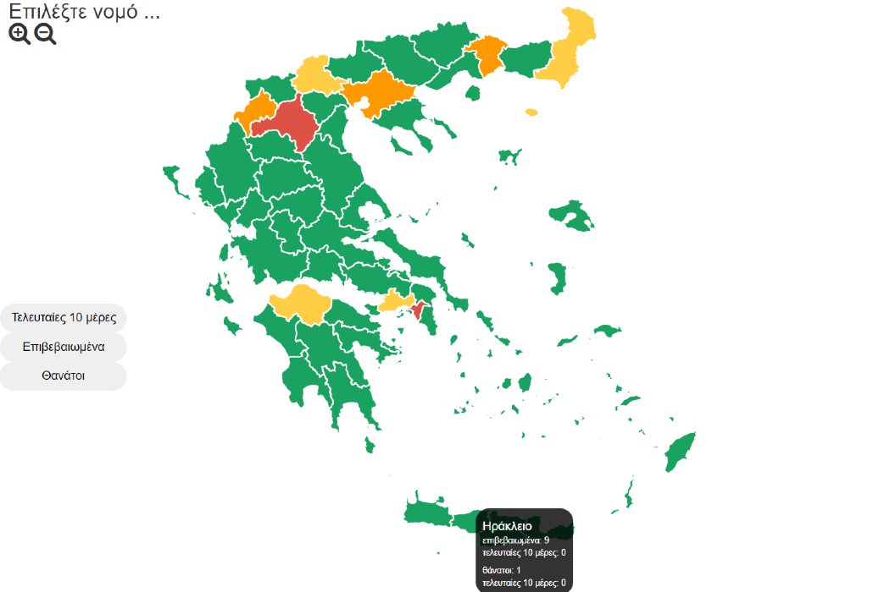

# d3-interactive-map-greece




An interactive Hong Kong Map using D3.js.

https://stamatelou.github.io/interactive_map_of_greece/

### Installing / Getting started

```shell
git clone git@github.com:ivan-ha/d3-hk-map.git
cd your-project
# open index.html in browser
```

### Built With
[D3.js v4](https://d3js.org)

### Deploy to GitHub page

I configured deploy script using [gh-pages](https://github.com/tschaub/gh-pages) to deploy the app to GitHub page

```shell
npm install
npm run deploy
```
